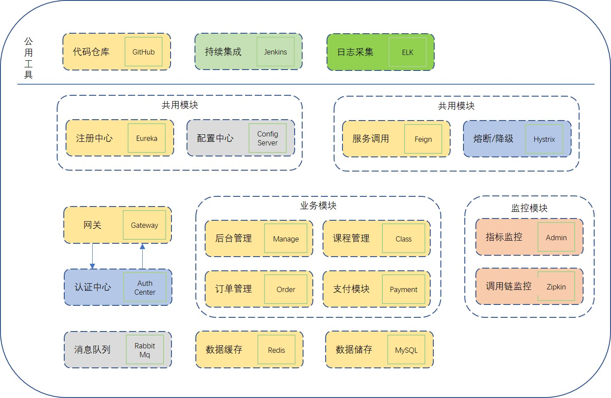

# spring-cloud-docker
spring-cloud的docker版本

## 项目架构

| 模块名称 | 端口 | 服务名 |
|:-----|:---|:----|
|Eureka注册中心|8761|eureka-server|
|GateWay网关|6604|gateway-server|
|统一配置中心|9999|config-server|

## 注意事项
common模块在其他模块调用打包前需要install
    
## 系统架构 2019-09-05

    
## 参考资料
[SpringCloud参考资源](https://blog.csdn.net/forezp/article/details/70148833)

[配置中心和自动刷新参考](https://artisan.blog.csdn.net/article/details/89117473#RefreshScope__actuatorbusrefresh_24)

[kafka数据总线](https://github.com/wurstmeister/kafka-docker)

[github项目](https://github.com/paascloud/paascloud-master)